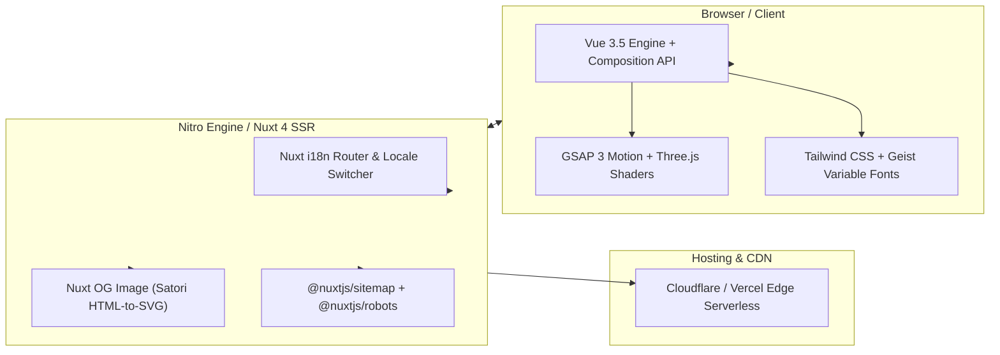
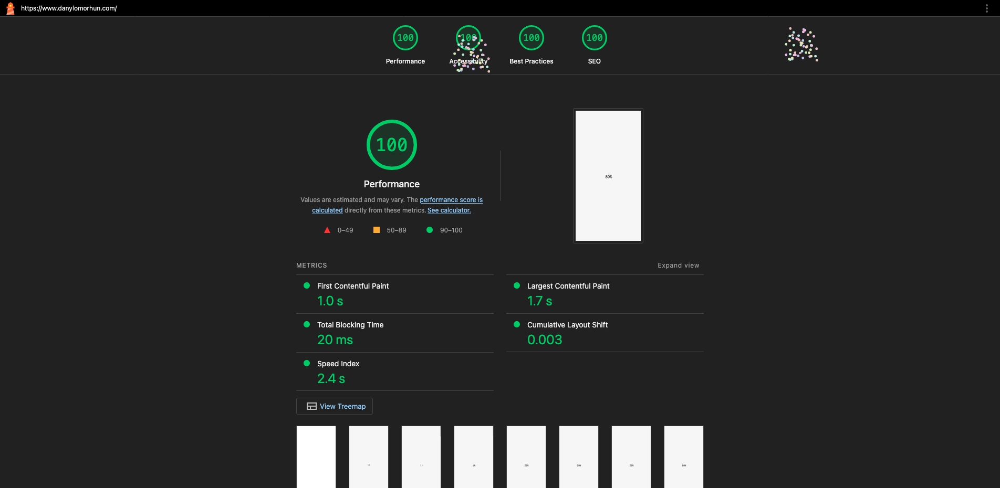

# danylomorhun.com — Personal Portfolio & Engineering Showcase

[](https://github.com/danylo-morhun/danylomorhun.com/actions/workflows/ci.yml)
[](https://nuxt.com/)
[](https://vuejs.org/)
[](https://www.typescriptlang.org/)
[](https://tailwindcss.com/)
[](https://pagespeed.web.dev/)

The personal portfolio and technical showcase of Danylo Morhun, Senior Full-Stack Engineer. Built from scratch with **Nuxt 4 (SSR)**, **Vue 3.5**, **TypeScript**, **GSAP 3**, and **Three.js**. Engine-optimized for **100/100 Core Web Vitals**, instant Server-Side Rendering (SSR), and dynamic social image generation.

**Live Website**: [https://danylomorhun.com](https://danylomorhun.com)

---

## System Architecture



---

## Core Web Vitals & Performance Engineering



- **100/100 Lighthouse Score Across All Categories**: Verified 100/100 on Performance, Accessibility, Best Practices, and SEO.
- **Sub-Second Core Web Vitals**: First Contentful Paint = 1.0s, Largest Contentful Paint = 1.7s, Total Blocking Time = 20ms, CLS = 0.003, Speed Index = 2.4s.
- **Hardware-Accelerated Motion**: GSAP 3 animations and Three.js 3D viewports run strictly on GPU compositor layers (`transform` / `opacity`).
- **Dynamic OG Image Generation**: Social share previews are synthesized on the edge using Satori HTML-to-SVG compilation (`nuxt-og-image`).

---

## Technical Stack & Modules

| Layer | Choice | Engineering Purpose |
| :--- | :--- | :--- |
| **Framework** | Nuxt 4 (Nitro Engine) | Universal Server-Side Rendering (SSR) for full search engine indexing and SEO metadata. |
| **Styling & Fonts** | Tailwind CSS + Geist | Design system powered by Geist Variable Sans & Mono typography. |
| **Internationalization** | `@nuxtjs/i18n` | Multi-language localized routes with dynamic locale resolution. |
| **Graphics & Motion** | GSAP 3 + Three.js | High-fps micro-interactions and interactive 3D WebGL canvases. |
| **Quality Gate** | Vitest + Playwright | Automated unit testing and E2E visual regression checks. |

---

## Local Development

### 1. Clone & Install
```bash
git clone git@github.com:danylo-morhun/danylomorhun.com.git
cd danylomorhun.com
npm install
```

### 2. Run Development Server
```bash
npm run dev
```
Open [http://localhost:3000](http://localhost:3000) in your browser.

### 3. Verification Commands
```bash
# Typecheck
npm run typecheck

# Unit Tests
npm run test

# Production Build Preview
npm run build && npm run preview
```

---

## License

MIT © Danylo Morhun
